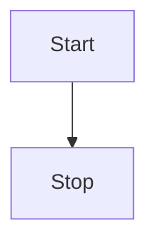

## 1. md-editor-v3

    

Markdown 编辑器，基于 react，使用 jsx 和 typescript 语法开发，支持切换主题、prettier 美化文本等。

### 1.1 基本演示

**加粗**，<u>下划线</u>，_斜体_，~删除线~，上标<sup>26</sup>，下标<sub>[1]</sub>，`inline code`，[超链接](https://imzbf.top)

1. 打开冰箱
2. 钻进去
3. 关闭冰箱

- 打开冰箱
- 钻出来
- 关闭冰箱

- [x] 打开冰箱
- [ ] 关闭冰箱

> 引用：这是一段文本引用


## 2. 代码演示

```js
import { defineComponent, ref } from 'vue';
import MdEditor from 'md-editor-v3';
import 'md-editor-v3/lib/style.css';

export default defineComponent({
  name: 'MdEditor',
  setup() {
    const text = ref('');
    return () => (
      <MdEditor modelValue={text.value} onChange={(v: string) => (text.value = v)} />
    );
  }
});
```

```shell [install:yarn]
yarn add md-editor-v3
```

```shell [install:npm]
npm i md-editor-v3
```

## 3. 文本演示

依照普朗克长度这项单位，目前可观测的宇宙的直径估计值（直径约 930 亿光年，即 8.8 × 10<sup>26</sup> 米）即为 5.4 × 10<sup>61</sup>倍普朗克长度。而可观测宇宙体积则为 8.4 × 10<sup>184</sup>立方普朗克长度（普朗克体积）。

## 4. 表格演示

| 昵称 | 猿龄（年） | 来自      |
| ---- | ---------- | --------- |
| 之间 | ∞          | 中国-重庆 |

## 5. 数学公式

$$
\begin{equation}
a^2+b^2=c^2
\end{equation}
$$

## 6. 图形



## 7. 占个坑@！

!!! note 支持的类型

note、abstract、info、tip、success、question、warning、failure、danger、bug、example、quote、hint、caution、error、attention

!!!
