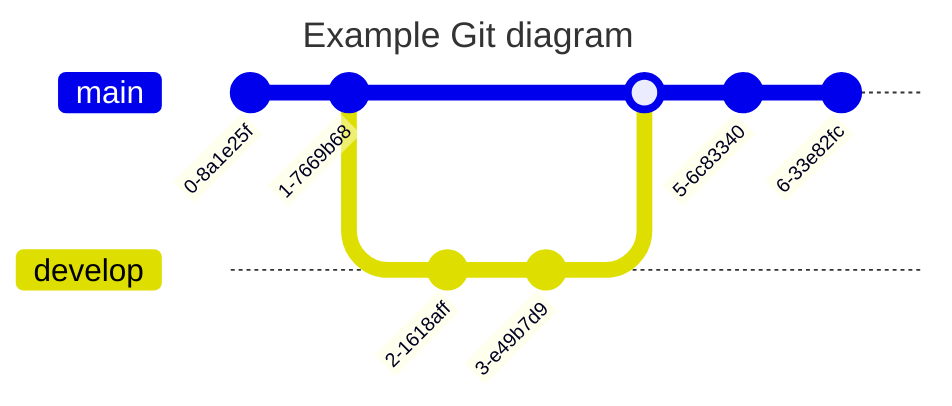

## 🐶 Heading

```markdown
## Heading
```

---

## 🐱 Bold

**I have a dream that one day this nation will rise up.**

```markdown
**I have a dream that one day this nation will rise up.**
```

---

## 🐭 Italic

_It is a dream deeply rooted in the American dream._

```markdown
_It is a dream deeply rooted in the American dream._
```

---

## 🐹 Strikethrough

~~It is a dream deeply rooted in the American dream.~~

```markdown
~~It is a dream deeply rooted in the American dream.~~
```

---

## 🐻 Link

[md-editor-v3](https://imzbf.github.io/md-editor-v3/)

```markdown
[md-editor-v3](https://imzbf.github.io/md-editor-v3/)
```

---

## 🐼 Picture


```markdown

```

---

## 🙉 Underline

<u>So even though we face the difficulties of today and tomorrow, I still have a dream.</u>

```markdown
<u>So even though we face the difficulties of today and tomorrow, I still have a dream.</u>
```

---

## 🙊 Superscript

I have a dream that one day this nation will rise up.<sup>[1]</sup>

```markdown
I have a dream that one day this nation will rise up.<sup>[1]</sup>
```

---

## 🐒 Subscript

I have a dream that one day this nation will rise up.<sub>[2]</sub>

```markdown
I have a dream that one day this nation will rise up.<sub>[2]</sub>
```

---

## 🐰 Inline Code

`md-editor-v3`

```markdown
`md-editor-v3`
```

---

## 🦊 Block Code

````markdown
```js
import MdEditor from 'md-editor-v3';
import 'md-editor-v3/lib/style.css';
```
````

### 🗄 Combination

```shell [id:yarn]
yarn add md-editor-v3
```

```shell [id:npm]
npm install md-editor-v3
```

```shell [id:pnpm]
pnpm install md-editor-v3
```

````markdown
```shell [id:yarn]
yarn add md-editor-v3
```

```shell [id:npm]
npm install md-editor-v3
```

```shell [id:pnpm]
pnpm install md-editor-v3
```
````

### 🤌🏻 Forcefully fold

```js ::close
import MdEditor from 'md-editor-v3';
import 'md-editor-v3/lib/style.css';
```

````markdown
```js ::close
import MdEditor from 'md-editor-v3';
import 'md-editor-v3/lib/style.css';
```
````

### 👐 Forcefully open

```js ::open
import MdEditor from 'md-editor-v3';
import 'md-editor-v3/lib/style.css';
```

````markdown
```js ::open
import MdEditor from 'md-editor-v3';
import 'md-editor-v3/lib/style.css';
```
````

According to the understanding of other editors, no other editors currently employ a similar syntax. Exercise caution when using this syntax if you intend to copy your content for display in other editors.

---

## 🐻‍❄️ Quote

> Quote: I Have a Dream

```markdown
> Quote: I Have a Dream
```

---

## 🐨 Ordered List

1. So even though we face the difficulties of today and tomorrow, I still have a dream.
2. It is a dream deeply rooted in the American dream.
3. I have a dream that one day this nation will rise up.

```markdown
1. So even though we face the difficulties of today and tomorrow, I still have a dream.
2. It is a dream deeply rooted in the American dream.
3. I have a dream that one day this nation will rise up.
```

---

## 🐯 Unordered List

- So even though we face the difficulties of today and tomorrow, I still have a dream.
- It is a dream deeply rooted in the American dream.
- I have a dream that one day this nation will rise up.

```markdown
- So even though we face the difficulties of today and tomorrow, I still have a dream.
- It is a dream deeply rooted in the American dream.
- I have a dream that one day this nation will rise up.
```

---

## 🦁 Task List

- [ ] Friday
- [ ] Saturday
- [x] Sunday

```markdown
- [ ] Friday
- [ ] Saturday
- [x] Sunday
```

[Example](https://imzbf.github.io/md-editor-v3/en-US/demo#☑%EF%B8%8F%20Toggleable%20status%20task%20list) that supports toggling task status in the preview module.

---

## 🐮 Table

| THead1          |      THead2       |           THead3 | THead4  |
| :-------------- | :---------------: | ---------------: | ------- |
| text-align:left | text-align:center | text-align:right | default |

```markdown
| THead1          |      THead2       |           THead3 | THead4  |
| :-------------- | :---------------: | ---------------: | ------- |
| text-align:left | text-align:center | text-align:right | default |
```

---

## 🐷 Mathematical Formula

Two modes.

### 🐽 Inline

$x+y^{2x}$

```markdown
$x+y^{2x}$
```

---

### 🐸 Block

$$\sqrt[3]{x}$$

```markdown
$$
\sqrt[3]{x}
$$

or

$$\sqrt[3]{x}$$
```

For more usage: [https://katex.org/docs/supported.html](https://katex.org/docs/supported.html)

---

## 🐵 Diagram



````markdown

````

For more usage: [https://mermaid.js.org/syntax/flowchart.html](https://mermaid.js.org/syntax/flowchart.html)

---

## 🙈 Alert

!!! note Supported Types

note、abstract、info、tip、success、question、warning、failure、danger、bug、example、quote、hint、caution、error、attention

!!!

```markdown
!!! note Supported Types

note、abstract、info、tip、success、question、warning

failure、danger、bug、example、quote、hint、caution、error、attention

!!!
```
