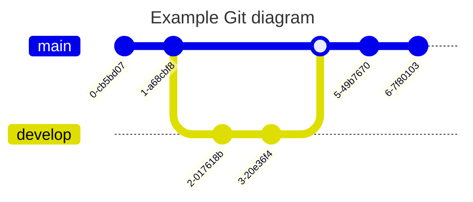

## 🐶 标题

```markdown
## 标题
```

---

## 🐱 加粗

**I have a dream that one day this nation will rise up.**

```markdown
**I have a dream that one day this nation will rise up.**
```

---

## 🐭 斜体

_It is a dream deeply rooted in the American dream._

```markdown
_It is a dream deeply rooted in the American dream._
```

---

## 🐹 删除线

~~It is a dream deeply rooted in the American dream.~~

```markdown
~~It is a dream deeply rooted in the American dream.~~
```

---

## 🐻 超链接

[md-editor-v3](https://imzbf.github.io/md-editor-v3/)

```markdown
[md-editor-v3](https://imzbf.github.io/md-editor-v3/)
```

---

## 🐼 图片


```markdown

```

---

## 🙉 下划线

<u>So even though we face the difficulties of today and tomorrow, I still have a dream.</u>

```markdown
<u>So even though we face the difficulties of today and tomorrow, I still have a dream.</u>
```

---

## 🙊 上标

I have a dream that one day this nation will rise up.<sup>[1]</sup>

```markdown
I have a dream that one day this nation will rise up.<sup>[1]</sup>
```

---

## 🐒 下标

I have a dream that one day this nation will rise up.<sub>[2]</sub>

```markdown
I have a dream that one day this nation will rise up.<sub>[2]</sub>
```

---

## 🐰 行内代码

`md-editor-v3`

```markdown
`md-editor-v3`
```

---

## 🦊 块级代码

````markdown
```js
import MdEditor from 'md-editor-v3';
import 'md-editor-v3/lib/style.css';
```
````

### 🗄 代码组合

```shell [id:yarn]
yarn add md-editor-v3
```

```shell [id:npm]
npm install md-editor-v3
```

```shell [id:pnpm]
pnpm install md-editor-v3
```

````markdown
```shell [id:yarn]
yarn add md-editor-v3
```

```shell [id:npm]
npm install md-editor-v3
```

```shell [id:pnpm]
pnpm install md-editor-v3
```
````

### 🤌🏻 强制折叠

```js ::close
import MdEditor from 'md-editor-v3';
import 'md-editor-v3/lib/style.css';
```

````markdown
```js ::close
import MdEditor from 'md-editor-v3';
import 'md-editor-v3/lib/style.css';
```
````

### 👐 强制展开

```js ::open
import MdEditor from 'md-editor-v3';
import 'md-editor-v3/lib/style.css';
```

````markdown
```js ::open
import MdEditor from 'md-editor-v3';
import 'md-editor-v3/lib/style.css';
```
````

据其他编辑器的了解，目前没有其他编辑器使用类似的语法，如果需要拷贝你的内容到其他编辑器展示时，请谨慎使用该语法。

---

## 🐻‍❄️ 引用

> 引用：《I Have a Dream》

```markdown
> 引用：《I Have a Dream》
```

---

## 🐨 有序列表

1. So even though we face the difficulties of today and tomorrow, I still have a dream.
2. It is a dream deeply rooted in the American dream.
3. I have a dream that one day this nation will rise up.

```markdown
1. So even though we face the difficulties of today and tomorrow, I still have a dream.
2. It is a dream deeply rooted in the American dream.
3. I have a dream that one day this nation will rise up.
```

---

## 🐯 无序列表

- So even though we face the difficulties of today and tomorrow, I still have a dream.
- It is a dream deeply rooted in the American dream.
- I have a dream that one day this nation will rise up.

```markdown
- So even though we face the difficulties of today and tomorrow, I still have a dream.
- It is a dream deeply rooted in the American dream.
- I have a dream that one day this nation will rise up.
```

---

## 🦁 任务列表

- [ ] 周五
- [ ] 周六
- [x] 周天

```markdown
- [ ] 周五
- [ ] 周六
- [x] 周天
```

---

## 🐮 表格

| 表头1  |  表头2   |  表头3 | 表头4 |
| :----- | :------: | -----: | ----- |
| 左对齐 | 中间对齐 | 右对齐 | 默认  |

```markdown
| 表头1  |  表头2   |  表头3 | 表头4 |
| :----- | :------: | -----: | ----- |
| 左对齐 | 中间对齐 | 右对齐 | 默认  |
```

---

## 🐷 数学公式

有两种模式

### 🐽 行内

$x+y^{2x}$

```markdown
$x+y^{2x}$
```

### 🐸 块级

$$\sqrt[3]{x}$$

```markdown
$$
\sqrt[3]{x}
$$

或者

$$\sqrt[3]{x}$$
```

更多公式示例参考：[https://katex.org/docs/supported.html](https://katex.org/docs/supported.html)

---

## 🐵 图表


````markdown

````

更多图形示例参考：[https://mermaid.js.org/syntax/flowchart.html](https://mermaid.js.org/syntax/flowchart.html)

---

## 🙈 提示

!!! note 支持的类型

note、abstract、info、tip、success、question、warning、failure、danger、bug、example、quote、hint、caution、error、attention

!!!

```markdown
!!! note 支持的类型

note、abstract、info、tip、success、question、warning

failure、danger、bug、example、quote、hint、caution、error、attention

!!!
```
