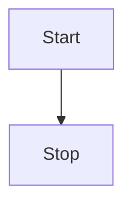

## 😲 md-editor-v3

Markdown Editor for Vue3, developed in jsx and typescript, support different themes、beautify content by prettier.

### 🤖 Base

**bold**, <u>underline</u>, _italic_, ~~line-through~~, superscript^26^, subscript~1~, `inline code`, [link](https://github.com/imzbf)

> quote: I Have a Dream

1. So even though we face the difficulties of today and tomorrow, I still have a dream.
2. It is a dream deeply rooted in the American dream.
3. I have a dream that one day this nation will rise up.

- [ ] Friday
- [ ] Saturday
- [x] Sunday


## 🤗 Code

```vue
<template>
  <MdEditor v-model="text" />
</template>

<script setup>
import { ref } from 'vue';
import { MdEditor } from 'md-editor-v3';
import 'md-editor-v3/lib/style.css';

const text = ref('Hello Editor!');
</script>
```

## 🖨 Text

The Old Man and the Sea served to reinvigorate Hemingway's literary reputation and prompted a reexamination of his entire body of work.

## 📈 Table

| THead1          |      THead2       |           THead3 |
| :-------------- | :---------------: | ---------------: |
| text-align:left | text-align:center | text-align:right |

## 📏 Formula

Inline: $x+y^{2x}$

$$
\sqrt[3]{x}
$$

## 🧬 Diagram

mermaid



echarts

```echarts
{
  tooltip: {
    trigger: 'axis'
  },
  xAxis: {
    type: 'category',
    data: ['Mon', 'Tue', 'Wed', 'Thu', 'Fri', 'Sat', 'Sun']
  },
  yAxis: {
    type: 'value'
  },
  series: [
    {
      data: [150, 230, 224, 218, 135, 147, 260],
      type: 'line'
    }
  ]
}
```

## 🪄 Alert

!!! note Supported Types

note、abstract、info、tip、success、question、warning、failure、danger、bug、example、quote、hint、caution、error、attention

!!!

## ☘️ em...

none
