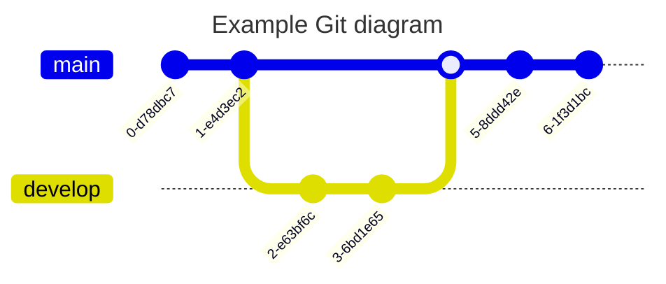

!!! tip

在使用行内语法（如加粗、斜体等）时，如果需要加粗的文本中包含特殊字符，并且加粗标识符（如 `**`）前后紧挨着其他字符，请务必在第二个标识符（如 `**`）后添加至少一个空格。否则，Markdown 解析器可能无法正确识别加粗效果。

示例：

错误写法：`AAA**I have a dream.**BBB`

正确写法：`AAA**I have a dream.** BBB`

同样的问题也适用于其它行内语法（如斜体等），请注意在语法标识符后添加空格以确保正确解析。

!!!

## 🐶 标题

```markdown
## 标题
```

---

## 🐱 加粗

**I have a dream that one day this nation will rise up.**

```markdown
**I have a dream that one day this nation will rise up.**
```

---

## 🐭 斜体

_It is a dream deeply rooted in the American dream._

```markdown
_It is a dream deeply rooted in the American dream._
```

---

## 🐹 删除线

~~It is a dream deeply rooted in the American dream.~~

```markdown
~~It is a dream deeply rooted in the American dream.~~
```

---

## 🐻 超链接

[md-editor-v3](https://imzbf.github.io/md-editor-v3/)

```markdown
[md-editor-v3](https://imzbf.github.io/md-editor-v3/)
```

---

## 🐼 图片


```markdown

```

---

## 🙉 下划线

<u>So even though we face the difficulties of today and tomorrow, I still have a dream.</u>

```markdown
<u>So even though we face the difficulties of today and tomorrow, I still have a dream.</u>
```

---

## 🙊 上标

I have a dream that one day this nation will rise up.^[1]^

```markdown
I have a dream that one day this nation will rise up.^[1]^
```

---

## 🐒 下标

I have a dream that one day this nation will rise up.~[2]~

```markdown
I have a dream that one day this nation will rise up.~[2]~
```

---

## 🐰 行内代码

`md-editor-v3`

```markdown
`md-editor-v3`
```

---

## 🦊 块级代码

````markdown
```js
import MdEditor from 'md-editor-v3';
import 'md-editor-v3/lib/style.css';
```
````

### 🗄 代码组合

```shell [id:yarn]
yarn add md-editor-v3
```

```shell [id:npm]
npm install md-editor-v3
```

```shell [id:pnpm]
pnpm install md-editor-v3
```

````markdown
```shell [id:yarn]
yarn add md-editor-v3
```

```shell [id:npm]
npm install md-editor-v3
```

```shell [id:pnpm]
pnpm install md-editor-v3
```
````

### 🤌🏻 强制折叠

```js ::close
import MdEditor from 'md-editor-v3';
import 'md-editor-v3/lib/style.css';
```

````markdown
```js ::close
import MdEditor from 'md-editor-v3';
import 'md-editor-v3/lib/style.css';
```
````

### 👐 强制展开

```js ::open
import MdEditor from 'md-editor-v3';
import 'md-editor-v3/lib/style.css';
```

````markdown
```js ::open
import MdEditor from 'md-editor-v3';
import 'md-editor-v3/lib/style.css';
```
````

据其他编辑器的了解，目前没有其他编辑器使用类似的语法，如果需要拷贝你的内容到其他编辑器展示时，请谨慎使用该语法。

---

## 🐻‍❄️ 引用

> 引用：《I Have a Dream》

```markdown
> 引用：《I Have a Dream》
```

---

## 🐨 有序列表

1. So even though we face the difficulties of today and tomorrow, I still have a dream.
2. It is a dream deeply rooted in the American dream.
3. I have a dream that one day this nation will rise up.

```markdown
1. So even though we face the difficulties of today and tomorrow, I still have a dream.
2. It is a dream deeply rooted in the American dream.
3. I have a dream that one day this nation will rise up.
```

---

## 🐯 无序列表

- So even though we face the difficulties of today and tomorrow, I still have a dream.
- It is a dream deeply rooted in the American dream.
- I have a dream that one day this nation will rise up.

```markdown
- So even though we face the difficulties of today and tomorrow, I still have a dream.
- It is a dream deeply rooted in the American dream.
- I have a dream that one day this nation will rise up.
```

---

## 🦁 任务列表

- [ ] 周五
- [ ] 周六
- [x] 周天

```markdown
- [ ] 周五
- [ ] 周六
- [x] 周天
```

支持在预览模块切换任务状态的[示例](https://imzbf.github.io/md-editor-v3/zh-CN/demo#☑%EF%B8%8F%20可切换状态的任务列表)

---

## 🐮 表格

| 表头 1 |  表头 2  | 表头 3 | 表头 4 |
| :----- | :------: | -----: | ------ |
| 左对齐 | 中间对齐 | 右对齐 | 默认   |

```markdown
| 表头 1 |  表头 2  | 表头 3 | 表头 4 |
| :----- | :------: | -----: | ------ |
| 左对齐 | 中间对齐 | 右对齐 | 默认   |
```

---

## 🐷 数学公式

有两种模式

### 🐽 行内

$x+y^{2x}$ \(\xrightarrow[under]{over}\)

```markdown
$x+y^{2x}$

<!-- or -->

\(\xrightarrow[under]{over}\)
```

---

### 🐸 块级

$$\sqrt[3]{x}$$

\[\xrightarrow[under]{over}\]

```markdown
$$
\sqrt[3]{x}
$$

<!-- or -->

\[\xrightarrow[under]{over}\]
```

更多公式示例参考：[https://katex.org/docs/supported.html](https://katex.org/docs/supported.html)

---

## 🐵 图表



````markdown
```
---
title: Example Git diagram
---
gitGraph
   commit
   commit
   branch develop
   checkout develop
   commit
   commit
   checkout main
   merge develop
   commit
   commit
```
````

更多图形示例参考：[https://mermaid.js.org/syntax/flowchart.html](https://mermaid.js.org/syntax/flowchart.html)

---

## 🙈 提示

!!! note 支持的类型

note、abstract、info、tip、success、question、warning、failure、danger、bug、example、quote、hint、caution、error、attention

!!!

```markdown
!!! note 支持的类型

note、abstract、info、tip、success、question、warning

failure、danger、bug、example、quote、hint、caution、error、attention

!!!
```

---

## 📊 Echarts

\>= v6.0.0

```echarts
{
  tooltip: {
    trigger: 'axis'
  },
  xAxis: {
    type: 'category',
    data: ['Mon', 'Tue', 'Wed', 'Thu', 'Fri', 'Sat', 'Sun']
  },
  yAxis: {
    type: 'value'
  },
  series: [
    {
      data: [150, 230, 224, 218, 135, 147, 260],
      type: 'line'
    }
  ]
}
```

````markdown
```echarts
{
  tooltip: {
    trigger: 'axis'
  },
  xAxis: {
    type: 'category',
    data: ['Mon', 'Tue', 'Wed', 'Thu', 'Fri', 'Sat', 'Sun']
  },
  yAxis: {
    type: 'value'
  },
  series: [
    {
      data: [150, 230, 224, 218, 135, 147, 260],
      type: 'line'
    }
  ]
}
```
````

!!! warning

请注意，该模块不会处理危险的代码，你需要自行保证数据的安全！

!!!

## 🦄 链接引用语法

[md-editor-v3][1]

[1]: https://imzbf.github.io/md-editor-v3/

```markdown
[md-editor-v3][1]

[1]: https://imzbf.github.io/md-editor-v3/
```
